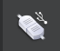
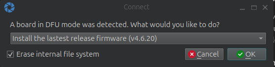
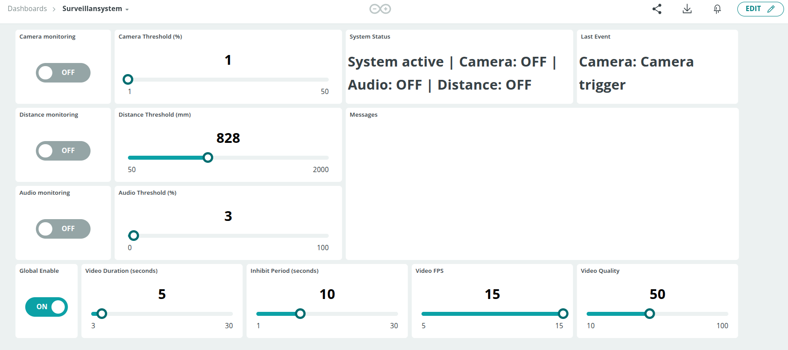

# Nicla Vision Alert Detector

## What is this project

The Nicla Vision Alert Detector is an intelligent video surveillance system based on Arduino Nicla Vision that leverages the advanced capabilities of the device to monitor the surrounding environment through three detection modes:

1. **Camera monitoring**: detects movements in the frame and records videos when a significant change is identified
2. **Microphone monitoring**: detects sounds that exceed a configurable threshold and activates recording
3. **Distance sensor monitoring**: identifies variations in distance from a baseline and activates recording

The system is fully integrable with Arduino IoT Cloud, which allows you to configure parameters, enable/disable features, and monitor the system status remotely. Additionally, it includes a Telegram bot that sends notifications, photos, and videos in real-time and allows you to control the device through simple commands.

## Who is it for

This system is ideal for:

- **Hobbyists and makers** who want to experiment with advanced video surveillance projects
- **Home automation enthusiasts** who want to integrate a customizable monitoring system
- **Developers** interested in exploring the capabilities of Arduino Nicla Vision
- **Small businesses** that need an economical but flexible surveillance system
- **Students and educators** in the field of robotics and IoT

## How it uses Arduino Nicla Vision

The project maximizes the hardware capabilities of Arduino Nicla Vision:

- **Integrated camera**: for motion detection and capturing photos/videos
- **Microphone**: for detecting sounds and noises
- **Time-of-Flight sensor (VL53L1X)**: for detecting distance variations
- **STM32H747 processor**: for image processing and running MicroPython code
- **WiFi connectivity**: for communication with Arduino IoT Cloud and sending notifications via Telegram
- **Integrated LEDs**: to provide visual feedback on system status

## Installation Guide

### Prerequisites

- Arduino Nicla Vision
- Arduino IoT Cloud account
- Telegram account
- OpenMV IDE installed on your computer
- MicroPython installed on Arduino Nicla Vision (version >= 1.2)
- WiFi connection

### 0. Download this repo
- Download the code for this project pressing "Code" green button in GitHub page -> Download Zip file

### 1. Installing Arduino Agent

- Follow the steps to install the Arduino Agent on Linux, Windows, or macOS:
[https://support.arduino.cc/hc/en-us/articles/360014869820-Install-the-Arduino-Cloud-Agent](https://support.arduino.cc/hc/en-us/articles/360014869820-Install-the-Arduino-Cloud-Agent)

### 2. Installing OpenMV IDE

1. Download OpenMV IDE from the official website: [https://openmv.io/pages/download](https://openmv.io/pages/download): choose the correct version for your current OS
2. Install the IDE following the instructions for your operating system

### 3. Setup MicroPython firmware on Arduino Nicla Vision
1. Download MicroPython firmware from this link: https://micropython.org/resources/firmware/ARDUINO_NICLA_VISION-20240105-v1.22.1.dfu
2. Connect Arduino Nicla Vision to your computer via USB cable
3. Double-press the Arduino Nicla Vision reset button on the device: a green light will start blinking
4. Click on the usb-attached icon: 
5. Click on "OK" when the following message appears 

6. Do not interrupt the installation of the firmware on your Nicla Vision and wait until the end.

### 3. Arduino IoT Cloud Configuration

1. **Log in to your Arduino IoT Cloud account** at [https://create.arduino.cc/iot](https://create.arduino.cc/iot)
2. **Create a new Thing**:
   - Click on "Create Thing"
   - Assign a name to your Thing (e.g., "NiclaVisionAlert")

3. **Associate the device**:
   - In the "Associated Devices" section, click on "Select Device"
   - Click on "Set Up New Device"
   - Select "Manual Device" at the bottom of the page and click "Continue"
   - Assign a name to your device and click "Continue"
   - **IMPORTANT**: Save the **Device ID** and the **Secret Key** that are generated, you will need them to connect the device to the cloud

4. **Create the following variables** in your Thing:

| Variable Name | Type | Description | Permission | Dashboard Widget |
|---------------|------|-------------|------------|-----------------|
| **audio_monitoring** | CloudSwitch | Enables or disables audio monitoring via the device's microphone. When active, the system detects sound levels exceeding the set threshold. | Read & Write | CloudSwitch |
| **audio_threshold** | int | Threshold level (0-100) that determines when a sound is considered an event. Lower values increase sensitivity, detecting quieter sounds. | Read & Write | Slider with min:0 - max:100 values range|
| **camera_monitoring** | CloudSwitch | Enables or disables monitoring through the camera. When active, the system detects motion based on brightness changes. | Read & Write | CloudSwitch |
| **camera_threshold** | int | Percentage of brightness change required to detect motion. Lower values increase sensitivity to subtle movements. | Read & Write | Slider with min:1 - max:50 values range |
| **distance_monitoring** | CloudSwitch | Enables or disables monitoring using the Time-of-Flight distance sensor. When active, detects changes in distance from the baseline. | Read & Write | CloudSwitch |
| **distance_threshold** | int | Distance variation in millimeters (mm) required to trigger a detection event. Higher values reduce sensitivity. | Read & Write | Slider with min:50 - max:2000 values range |
| **event_type** | String | Identifies the type of the latest detected event (Camera, Audio, or Distance). | Read & Write | Not displayed |
| **global_enable** | CloudSwitch | Master switch that activates or deactivates the entire monitoring system. When disabled, no detections occur regardless of individual settings. | Read & Write | CloudSwitch |
| **inhibit_period** | int | Minimum time in seconds that must elapse between consecutive detection events. Prevents multiple notifications for the same event. | Read & Write | Slider with min:1 - max:30 values range |
| **last_event** | String | Details about the most recent detection event, including type and additional information. | Read Only | Value |
| **log_messages** | String | System log messages providing information about operations, errors, and status changes. | Read Only | Messenger |
| **system_status** | String | Current operational status of the system, showing which monitoring features are active. | Read Only | Value |
| **video_duration** | int | Length of recorded videos in seconds when an event is detected. | Read & Write | Slider with min:3 - max:30 values range |
| **video_fps** | int | Frames per second for video recording. Higher values result in smoother videos but larger file sizes. | Read & Write | Slider with min:5 - max:15 values range |
| **video_quality** | int | Video compression quality (0-100). Higher values produce better quality but larger file sizes. | Read & Write | Slider with min:10 - max:100 values range |

5. **Create a Dashboard**:
   - Go to the "Dashboards" section and click "Create Dashboard"
   - Assign a name to the dashboard (e.g., "NiclaVision Control", or "Surveillansystem", as in the image below)
   - Add widgets following the examples provided in the previous table
   - You can organize all the widgets in a layout similar to the following in the image:
   

### 4. Creating the Telegram Bot

1. **Create a new bot on Telegram**:
   - Open Telegram App on your smartphone or browser webapp from Linux, Windows or Mac (https://web.telegram.org/)
   - Search for "BotFather" account in the search bar: pay attention to choose the one with the blue tick in the name: it is the only official one!
   - Start a chat with BotFather (@BotFather)
   - Send the command `/newbot`
   - Follow the instructions to give a name to your bot
   - At the end, you will receive a **token** for the bot API. Save it, you will need it to configure the system

2. **Get your chat ID**:
   - Now search for IDBot (@myidbot) on Telegram search bar and start a chat
   - Send the command `/getid`
   - The bot will reply with your **chat ID**. Save it, you will need it to authorize your account

### 5. Preparing files on the device

1. **Check the `secrets_keys.py` file**:
   - In the downloaded folder with project code, open the main folder and find `secrets_keys.py` file with generic information
   - Open this file with a text editor of your choice (be sure not to use a word processor software like "Word") and modify the information with your personal data for wifi connection and other info obtained from Arduino IoT Cloud platform and BotFather:

   ```python
   # WiFi credentials
   WIFI_SSID = "Your_WiFi_SSID"
   WIFI_PASS = "Your_WiFi_Password"

   # Arduino IoT Cloud credentials
   DEVICE_ID = "your_device_id"  # Device ID provided by Arduino IoT Cloud
   SECRET_KEY = "your_secret_key"  # Secret Key provided by Arduino IoT Cloud

   # Telegram bot credentials
   TELEGRAM_TOKEN = "your_bot_token"  # Token provided by BotFather
   TELEGRAM_AUTHORIZED_USERS = ["your_chat_id"]  # List of authorized chat IDs
   # You can use ["*"] to allow anyone to use the bot
   ```

2. **Upload all files to the device**:
   - Upload all the files and folders provided in the repository downloaded but **be sure not to copy** the `img` folder. Include the `secrets_keys.py` file just modified with your data
   - **Make sure all files are uploaded to the main directory of the device**
   - Disconnect Arduino Nicla Vision safetly from your USB port

### 6. Starting the system

1. **Restart the device**:
   - Reconnect the device to USB port or just power it from a USB power source
   - The system should start automatically

2. **Test with Telegram**:
   - In the Telegram App, go to the chatbot conversation
   - Send a "/start" command to it
   - At this point, if you correctly inserted your `chat_id` in the `TELEGRAM_AUTHORIZED_USERS` variables in `secrets_keys.py` file, the System shall message you automatically with a Notification about the system to be started and ready
   - You could need to wait some seconds to receive this message, if this doesn't happen, try to restart the device.
   - Type "/help" for the complete list of available commands to send to the telegram bot

3. **Test the Arduino Dashboard**
   - Go to your Dashboard page and test all the switches and sliders changing values and trying to activate "Global Enable" first, then the different detection modalities.
   
## Usage Examples

### Controlling the system via Telegram

The Telegram bot supports the following commands:

#### General

- `/start` - Start the bot and show the welcome message
- `/status` - Show the system status
- `/enable` - Enable global monitoring
- `/disable` - Disable global monitoring
- `/camera_on` - Enable camera monitoring
- `/camera_off` - Disable camera monitoring
- `/audio_on` - Enable microphone monitoring
- `/audio_off` - Disable microphone monitoring
- `/distance_on` - Enable distance sensor monitoring
- `/distance_off` - Disable distance sensor monitoring
- `/photo` - Take an instant photo
- `/photos_on` - Enable automatic photo sending
- `/photos_off` - Disable automatic photo sending
- `/video` - Record an instant video
- `/videos_on` - Enable automatic video recording
- `/videos_off` - Disable automatic video recording

#### Threshold Settings
- `/set_camera_threshold X` - Set camera threshold (%) (1-50)
- `/set_audio_threshold X` - Set audio threshold (%) (0-100)
- `/set_distance_threshold X` - Set distance threshold (mm) (50-2000)

#### Video Settings
- `/set_video_duration X` - Set video duration in seconds (3-30)
- `/set_video_fps X` - Set frames per second (5-15)
- `/set_video_quality X` - Set video quality (10-100)

#### Photo Settings
- `/set_photo_quality X` - Set photo quality (10-100)

#### Other Settings
- `/set_inhibit_period X` - Set inhibition period in seconds (1-30)
- `/set_audio_gain X` - Set audio gain in dB (0-48)

#### Other Information
- `/show_settings` - Show all current settings

### Configuration via Arduino IoT Cloud

You can use the dashboard created on Arduino IoT Cloud to:

1. **Enable/disable monitoring features**:
   - Use switches to enable/disable the system globally or individual modes

2. **Adjust detection parameters**:
   - Modify the thresholds for motion, audio, and distance detection
   - Configure video duration and frame rate

3. **Monitor system status**:
   - View the current status
   - Check the last detected event
   - Read log messages

### Usage Scenarios

1. **Room monitoring**:
   - Position Arduino Nicla Vision in a strategic point
   - Enable camera and audio monitoring
   - Receive notifications, photos, and videos when motion or sound is detected

2. **Valuable object monitoring**:
   - Position Arduino Nicla Vision in front of the object
   - Enable distance sensor monitoring
   - Receive notifications when someone approaches the object

3. **Advanced baby monitor**:
   - Position Arduino Nicla Vision in the baby's room
   - Enable audio monitoring with an appropriate threshold
   - Receive notifications and images when the baby cries

## Possible Implementations

Here are some ideas to extend and further improve the project:

1. **Facial recognition**:
   - Implement facial recognition algorithms to distinguish between authorized people and intruders

2. **Object recognition**:
   - Use machine learning models to identify specific objects in the field of view

3. **Advanced audio analysis**:
   - Implement recognition of specific sounds (broken glass, alarms, etc.)

4. **Integration with home automation systems**:
   - Connect the system to platforms like Home Assistant or Google Home

5. **Cloud storage**:
   - Save photos and videos to cloud storage services like Google Drive or Dropbox

6. **Dedicated web interface**:
   - Develop a dedicated web interface for system management

7. **Multi-camera support**:
   - Expand the system to support multiple Nicla Vision devices in a network

8. **Data analysis**:
   - Implement features to analyze collected data and generate statistics

9. **Low power mode**:
   - Optimize power consumption for longer battery operation

10. **Two-factor authentication**:
    - Implement a more secure authentication system for remote control

---

## Troubleshooting Common Issues (FAQ)

### The device doesn't connect to WiFi

- Verify that the WiFi credentials in `secrets_keys.py` are correct
- Make sure the WiFi network is available and stable
- Restart the device

### The device doesn't connect to Arduino IoT Cloud

- Verify that the Device ID and Secret Key in `secrets_keys.py` are correct
- Check that the WiFi connection is working properly
- Verify that the Thing on Arduino IoT Cloud is configured correctly

### The Telegram bot doesn't respond

- Verify that the bot token in `secrets_keys.py` is correct
- Make sure your chat ID is included in the list of authorized users
- Check that the WiFi connection is working properly

### Detection doesn't work correctly

- Adjust the detection thresholds via Arduino IoT Cloud or Telegram commands
- Make sure the device is properly positioned
- Verify that the desired monitoring mode is activated
- The default config values shall work in the usual scenarios, however you can check and recalibrate values according to your context and needs

### Video recording fails

- Check the available space on the device memory
- Decrease the duration or quality of the videos
- Restart the device to free up memory

---

For any issues or questions, you can create an issue in the GitHub repository of the project or contact Emilio (@destone28) <emilio.destratis@gmail.com>.

---
---
---
ITALIAN VERSION:


# Nicla Vision Alert Detector

## Cos'è questo progetto

Il Nicla Vision Alert Detector è un sistema di videosorveglianza intelligente basato su Arduino Nicla Vision che sfrutta le capacità avanzate del dispositivo per monitorare l'ambiente circostante attraverso tre modalità di rilevamento:

1. **Monitoraggio tramite camera**: rileva movimenti nell'inquadratura e registra video quando viene identificato un cambiamento significativo
2. **Monitoraggio tramite microfono**: rileva suoni che superano una soglia configurabile e attiva la registrazione
3. **Monitoraggio tramite sensore di distanza**: identifica variazioni nella distanza rispetto a una baseline e attiva la registrazione

Il sistema è completamente integrabile con Arduino IoT Cloud, che permette di configurare parametri, abilitare/disabilitare funzionalità e monitorare lo stato del sistema da remoto. Inoltre, include un bot Telegram che invia notifiche, foto e video in tempo reale e permette di controllare il dispositivo tramite semplici comandi.

## A chi è rivolto

Questo sistema è ideale per:

- **Hobbisti e maker** che desiderano sperimentare con progetti avanzati di videosorveglianza
- **Appassionati di domotica** che vogliono integrare un sistema di monitoraggio personalizzabile
- **Sviluppatori** interessati all'esplorazione delle capacità di Arduino Nicla Vision
- **Piccole imprese** che necessitano di un sistema di sorveglianza economico ma flessibile
- **Studenti e educatori** nel campo della robotica e dell'IoT

## Come utilizza Arduino Nicla Vision

Il progetto sfrutta al massimo le capacità hardware dell'Arduino Nicla Vision:

- **Camera integrata**: per il rilevamento del movimento e la cattura di foto/video
- **Microfono**: per il rilevamento di suoni e rumori
- **Sensore Time-of-Flight (VL53L1X)**: per il rilevamento delle variazioni di distanza
- **Processore STM32H747**: per l'elaborazione delle immagini e l'esecuzione del codice MicroPython
- **Connettività WiFi**: per la comunicazione con Arduino IoT Cloud e l'invio di notifiche via Telegram
- **LED integrati**: per fornire feedback visivi sullo stato del sistema

## Guida all'installazione

### Prerequisiti

- Arduino Nicla Vision
- Account Arduino IoT Cloud
- Account Telegram
- OpenMV IDE installato sul computer
- MicroPython installato su Arduino Nicla Vision (versione >= 1.2)
- Connessione WiFi

### 0. Scarica questo repository
- Scarica il codice per questo progetto premendo il pulsante verde "Code" nella pagina GitHub -> Download Zip file

### 1. Installazione di Arduino Agent

- Segui i passaggi per installare l'Arduino Agent su Linux, Windows o macOS all'indirizzo:
[https://support.arduino.cc/hc/en-us/articles/360014869820-Install-the-Arduino-Cloud-Agent](https://support.arduino.cc/hc/en-us/articles/360014869820-Install-the-Arduino-Cloud-Agent)

### 2. Installazione di OpenMV IDE

1. Scarica OpenMV IDE dal sito ufficiale: [https://openmv.io/pages/download](https://openmv.io/pages/download): scegli la versione corretta per il tuo sistema operativo
2. Installa l'IDE seguendo le istruzioni per il tuo sistema operativo

### 3. Configurazione del firmware MicroPython su Arduino Nicla Vision
1. Scarica il firmware MicroPython da questo link: https://micropython.org/resources/firmware/ARDUINO_NICLA_VISION-20240105-v1.22.1.dfu
2. Collega Arduino Nicla Vision al computer tramite cavo USB
3. Premi due volte il pulsante di reset di Arduino Nicla Vision sul dispositivo: una luce verde inizierà a lampeggiare
4. Clicca sull'icona usb-attached: 
5. Clicca su "OK" quando appare il seguente messaggio 

6. Non interrompere l'installazione del firmware sul tuo Nicla Vision e attendi fino alla fine.

### 3. Configurazione Arduino IoT Cloud

1. **Accedi al tuo account Arduino IoT Cloud** all'indirizzo [https://create.arduino.cc/iot](https://create.arduino.cc/iot)
2. **Crea una nuova Thing**:
   - Clicca su "Create Thing"
   - Assegna un nome alla tua Thing (ad esempio "NiclaVisionAlert")

3. **Associa il dispositivo**:
   - Nella sezione "Associated Devices" clicca su "Select Device"
   - Clicca su "Set Up New Device"
   - Seleziona "Manual Device" in fondo alla pagina e clicca "Continue"
   - Assegna un nome al tuo dispositivo e clicca "Continue"
   - **IMPORTANTE**: Salva il **Device ID** e il **Secret Key** che vengono generati, serviranno per connettere il dispositivo al cloud

4. **Crea le seguenti variabili** nella tua Thing:

| Nome Variabile | Tipo | Descrizione | Permessi | Widget Dashboard |
|---------------|------|-------------|------------|-----------------|
| **audio_monitoring** | CloudSwitch | Attiva/disattiva il monitoraggio audio tramite il microfono del dispositivo. Quando attivo, il sistema rileva livelli sonori che superano la soglia impostata. | Lettura & Scrittura | CloudSwitch |
| **audio_threshold** | int | Livello di soglia (0-100) che determina quando un suono viene considerato un evento. Valori più bassi aumentano la sensibilità, rilevando suoni più silenziosi. | Lettura & Scrittura | Slider con intervallo di valori min:0 - max:100 |
| **camera_monitoring** | CloudSwitch | Attiva/disattiva il monitoraggio tramite la camera. Quando attivo, il sistema rileva movimenti basati su cambiamenti di luminosità. | Lettura & Scrittura | CloudSwitch |
| **camera_threshold** | int | Percentuale di cambiamento di luminosità richiesta per rilevare un movimento. Valori più bassi aumentano la sensibilità a movimenti sottili. | Lettura & Scrittura | Slider con intervallo di valori min:1 - max:50 |
| **distance_monitoring** | CloudSwitch | Attiva/disattiva il monitoraggio tramite il sensore di distanza Time-of-Flight. Quando attivo, rileva cambiamenti nella distanza rispetto alla linea di base. | Lettura & Scrittura | CloudSwitch |
| **distance_threshold** | int | Variazione di distanza in millimetri (mm) richiesta per attivare un evento di rilevamento. Valori più alti riducono la sensibilità. | Lettura & Scrittura | Slider con intervallo di valori min:50 - max:2000 |
| **event_type** | String | Identifica il tipo dell'ultimo evento rilevato (Camera, Audio o Distance). | Lettura & Scrittura | Non visualizzato |
| **global_enable** | CloudSwitch | Interruttore principale che attiva o disattiva l'intero sistema di monitoraggio. Quando disabilitato, non avviene alcun rilevamento indipendentemente dalle impostazioni individuali. | Lettura & Scrittura | CloudSwitch |
| **inhibit_period** | int | Tempo minimo in secondi che deve trascorrere tra eventi di rilevamento consecutivi. Previene notifiche multiple per lo stesso evento. | Lettura & Scrittura | Slider con intervallo di valori min:1 - max:30 |
| **last_event** | String | Dettagli sull'evento di rilevamento più recente, inclusi tipo e informazioni aggiuntive. | Solo Lettura | Value |
| **log_messages** | String | Messaggi di log del sistema che forniscono informazioni su operazioni, errori e cambiamenti di stato. | Solo Lettura | Messenger |
| **system_status** | String | Stato operativo corrente del sistema, che mostra quali funzionalità di monitoraggio sono attive. | Solo Lettura | Value |
| **video_duration** | int | Durata dei video registrati in secondi quando viene rilevato un evento. | Lettura & Scrittura | Slider con intervallo di valori min:3 - max:30 |
| **video_fps** | int | Fotogrammi al secondo per la registrazione video. Valori più alti producono video più fluidi ma file più grandi. | Lettura & Scrittura | Slider con intervallo di valori min:5 - max:15 |
| **video_quality** | int | Qualità di compressione video (0-100). Valori più alti producono una qualità migliore ma file più grandi. | Lettura & Scrittura | Slider con intervallo di valori min:10 - max:100 |

5. **Crea una Dashboard**:
   - Vai alla sezione "Dashboards" e clicca "Create Dashboard"
   - Assegna un nome alla dashboard (ad esempio "NiclaVision Control", o "Surveillansystem", come nell'immagine seguente)
   - Aggiungi widget seguendo gli esempi forniti nella tabella precedente
   - Puoi organizzare tutti i widget in un layout simile a quello nell'immagine seguente:
   

### 4. Creazione del Bot Telegram

1. **Crea un nuovo bot su Telegram**:
   - Apri l'App Telegram sul tuo smartphone o la webapp del browser da Linux, Windows o Mac (https://web.telegram.org/)
   - Cerca l'account "BotFather" nella barra di ricerca: fai attenzione a scegliere quello con il segno di spunta blu nel nome: è l'unico ufficiale!
   - Avvia una chat con BotFather (@BotFather)
   - Invia il comando `/newbot`
   - Segui le istruzioni per dare un nome al tuo bot
   - Alla fine, riceverai un **token** per l'API del bot. Salvalo, ti servirà per configurare il sistema

2. **Ottieni il tuo chat ID**:
   - Ora cerca IDBot (@myidbot) nella barra di ricerca di Telegram e avvia una chat
   - Invia il comando `/getid`
   - Il bot risponderà con il tuo **chat ID**. Salvalo, ti servirà per autorizzare il tuo account

### 5. Preparazione dei file sul dispositivo

1. **Verifica il file `secrets_keys.py`**:
   - Nella cartella scaricata con il codice del progetto, apri la cartella principale e trova il file `secrets_keys.py` con informazioni generiche
   - Apri questo file con un editor di testo a tua scelta (assicurati di non utilizzare un elaboratore di testi come "Word") e modifica le informazioni con i tuoi dati personali per la connessione WiFi e altre info ottenute dalla piattaforma Arduino IoT Cloud e da BotFather:

   ```python
   # WiFi credentials
   WIFI_SSID = "Your_WiFi_SSID"
   WIFI_PASS = "Your_WiFi_Password"

   # Arduino IoT Cloud credentials
   DEVICE_ID = "your_device_id"  # Device ID provided by Arduino IoT Cloud
   SECRET_KEY = "your_secret_key"  # Secret Key provided by Arduino IoT Cloud

   # Telegram bot credentials
   TELEGRAM_TOKEN = "your_bot_token"  # Token provided by BotFather
   TELEGRAM_AUTHORIZED_USERS = ["your_chat_id"]  # List of authorized chat IDs
   # You can use ["*"] to allow anyone to use the bot
   ```

2. **Carica tutti i file sul dispositivo**:
   - Carica tutti i file e le cartelle forniti nel repository scaricato ma **assicurati di non copiare** la cartella `img`. Includi il file `secrets_keys.py` appena modificato con i tuoi dati
   - **Assicurati che tutti i file siano caricati nella directory principale del dispositivo**
   - Disconnetti Arduino Nicla Vision in modo sicuro dalla porta USB

### 6. Avvio del sistema

1. **Riavvia il dispositivo**:
   - Ricollega il dispositivo alla porta USB o alimentalo semplicemente da una fonte di alimentazione USB
   - Il sistema dovrebbe avviarsi automaticamente

2. **Test con Telegram**:
   - Nell'App Telegram, vai alla conversazione con il chatbot
   - Invia un comando "/start"
   - A questo punto, se hai inserito correttamente il tuo `chat_id` nella variabile `TELEGRAM_AUTHORIZED_USERS` nel file `secrets_keys.py`, il Sistema ti invierà automaticamente un Messaggio di Notifica che indica che il sistema è stato avviato ed è pronto
   - Potresti dover attendere alcuni secondi per ricevere questo messaggio; se non arriva, prova a riavviare il dispositivo
   - Digita "/help" per la lista completa dei comandi disponibili da inviare al bot telegram

3. **Test della Dashboard Arduino**
   - Vai alla tua pagina Dashboard e testa tutti gli switch e gli slider modificando i valori e cercando di attivare prima "Global Enable", poi le diverse modalità di rilevamento.
   
## Esempi di utilizzo

### Controllo del sistema via Telegram

Il bot Telegram supporta i seguenti comandi:

#### Generali

- `/start` - Avvia il bot e mostra il messaggio di benvenuto
- `/status` - Mostra lo stato del sistema
- `/enable` - Attiva il monitoraggio globale
- `/disable` - Disattiva il monitoraggio globale
- `/camera_on` - Attiva il monitoraggio tramite camera
- `/camera_off` - Disattiva il monitoraggio tramite camera
- `/audio_on` - Attiva il monitoraggio tramite microfono
- `/audio_off` - Disattiva il monitoraggio tramite microfono
- `/distance_on` - Attiva il monitoraggio tramite sensore di distanza
- `/distance_off` - Disattiva il monitoraggio tramite sensore di distanza
- `/photo` - Scatta una foto istantanea
- `/photos_on` - Attiva l'invio automatico di foto
- `/photos_off` - Disattiva l'invio automatico di foto
- `/video` - Registra un video istantaneo
- `/videos_on` - Attiva la registrazione automatica di video
- `/videos_off` - Disattiva la registrazione automatica di video

#### Impostazioni delle soglie
- `/set_camera_threshold X` - Imposta soglia camera (%) (1-50)
- `/set_audio_threshold X` - Imposta soglia audio (%) (0-100)
- `/set_distance_threshold X` - Imposta soglia distanza (mm) (50-2000)

#### Impostazioni video
- `/set_video_duration X` - Imposta durata video in secondi (3-30)
- `/set_video_fps X` - Imposta fotogrammi al secondo (5-15)
- `/set_video_quality X` - Imposta qualità video (10-100)

#### Impostazioni foto
- `/set_photo_quality X` - Imposta qualità foto (10-100)

#### Altre impostazioni
- `/set_inhibit_period X` - Imposta periodo di inibizione in secondi (1-30)
- `/set_audio_gain X` - Imposta guadagno audio in dB (0-48)

#### Altre informazioni
- `/show_settings` - Mostra tutte le impostazioni correnti

### Configurazione tramite Arduino IoT Cloud

Puoi utilizzare la dashboard creata su Arduino IoT Cloud per:

1. **Attivare/disattivare le funzionalità di monitoraggio**:
   - Usa gli switch per attivare/disattivare il sistema globalmente o singole modalità

2. **Regolare i parametri di rilevamento**:
   - Modifica le soglie di rilevamento movimento, audio e distanza
   - Configura la durata dei video e la frequenza dei fotogrammi

3. **Monitorare lo stato del sistema**:
   - Visualizza lo stato attuale
   - Controlla l'ultimo evento rilevato
   - Leggi i messaggi di log

### Scenari di utilizzo

1. **Monitoraggio di una stanza**:
   - Posiziona Arduino Nicla Vision in un punto strategico
   - Attiva il monitoraggio tramite camera e audio
   - Ricevi notifiche, foto e video quando viene rilevato movimento o suono

2. **Monitoraggio di un oggetto di valore**:
   - Posiziona Arduino Nicla Vision di fronte all'oggetto
   - Attiva il monitoraggio tramite sensore di distanza
   - Ricevi notifiche quando qualcuno si avvicina all'oggetto

3. **Baby monitor avanzato**:
   - Posiziona Arduino Nicla Vision nella stanza del bambino
   - Attiva il monitoraggio audio con una soglia appropriata
   - Ricevi notifiche e immagini quando il bambino piange

## Possibili implementazioni

Ecco alcune idee per estendere e migliorare ulteriormente il progetto:

1. **Riconoscimento facciale**:
   - Implementare algoritmi di riconoscimento facciale per distinguere tra persone autorizzate e intrusi

2. **Riconoscimento oggetti**:
   - Utilizzare modelli di machine learning per identificare oggetti specifici nel campo visivo

3. **Analisi audio avanzata**:
   - Implementare il riconoscimento di suoni specifici (vetri rotti, allarmi, etc.)

4. **Integrazione con sistemi di domotica**:
   - Collegare il sistema a piattaforme come Home Assistant o Google Home

5. **Archiviazione cloud**:
   - Salvare foto e video su servizi di storage cloud come Google Drive o Dropbox

6. **Interfaccia web dedicata**:
   - Sviluppare un'interfaccia web dedicata per la gestione del sistema

7. **Supporto multi-camera**:
   - Espandere il sistema per supportare più dispositivi Nicla Vision in rete

8. **Analisi dei dati**:
   - Implementare funzionalità per analizzare i dati raccolti e generare statistiche

9. **Modalità a basso consumo**:
   - Ottimizzare il consumo energetico per un utilizzo a batteria più prolungato

10. **Autenticazione a due fattori**:
    - Implementare un sistema di autenticazione più sicuro per il controllo remoto

---

## Risoluzione dei problemi comuni (FAQ)

### Il dispositivo non si connette al WiFi

- Verifica che le credenziali WiFi in `secrets_keys.py` siano corrette
- Assicurati che la rete WiFi sia disponibile e stabile
- Riavvia il dispositivo

### Il dispositivo non si connette ad Arduino IoT Cloud

- Verifica che Device ID e Secret Key in `secrets_keys.py` siano corretti
- Controlla che la connessione WiFi funzioni correttamente
- Verifica che la Thing su Arduino IoT Cloud sia configurata correttamente

### Il bot Telegram non risponde

- Verifica che il token del bot in `secrets_keys.py` sia corretto
- Assicurati che il tuo chat ID sia incluso nella lista degli utenti autorizzati
- Controlla che la connessione WiFi funzioni correttamente

### Il rilevamento non funziona correttamente

- Regola le soglie di rilevamento tramite Arduino IoT Cloud o i comandi Telegram
- Assicurati che il dispositivo sia posizionato correttamente
- Verifica che la modalità di monitoraggio desiderata sia attivata
- I valori di configurazione predefiniti dovrebbero funzionare negli scenari usuali, tuttavia puoi controllare e ricalibrare i valori in base al tuo contesto e alle tue esigenze

### La registrazione video fallisce

- Controlla lo spazio disponibile sulla memoria del dispositivo
- Diminuisci la durata o la qualità dei video
- Riavvia il dispositivo per liberare memoria

---

Per qualsiasi problema o domanda, puoi creare un issue nel repository GitHub del progetto o contattare Emilio (@destone28) <emilio.destratis@gmail.com>.

---