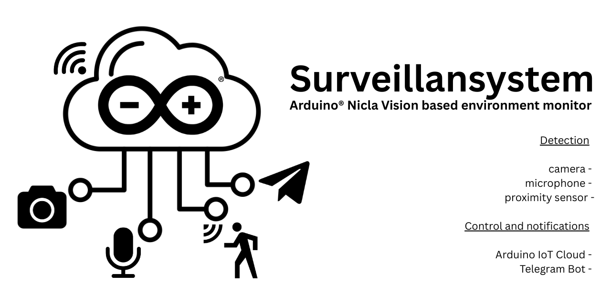

# Nicla Vision Alert Detector

## What is this project

The Nicla Vision Alert Detector is an intelligent video surveillance system based on Arduino Nicla Vision that leverages the advanced capabilities of the device to monitor the surrounding environment through three detection modes:

1. **Camera monitoring**: detects movements in the frame and records videos when a significant change is identified
2. **Microphone monitoring**: detects sounds that exceed a configurable threshold and activates recording
3. **Distance sensor monitoring**: identifies variations in distance from a baseline and activates recording

The system is fully integrable with Arduino IoT Cloud, which allows you to configure parameters, enable/disable features, and monitor the system status remotely. Additionally, it includes a Telegram bot that sends notifications, photos, and videos in real-time and allows you to control the device through simple commands.

## Who is it for

This system is ideal for:

- **Hobbyists and makers** who want to experiment with advanced video surveillance projects
- **Home automation enthusiasts** who want to integrate a customizable monitoring system
- **Developers** interested in exploring the capabilities of Arduino Nicla Vision
- **Small businesses** that need an economical but flexible surveillance system
- **Students and educators** in the field of robotics and IoT

## How it uses Arduino Nicla Vision

The project maximizes the hardware capabilities of Arduino Nicla Vision:

- **Integrated camera**: for motion detection and capturing photos/videos
- **Microphone**: for detecting sounds and noises
- **Time-of-Flight sensor (VL53L1X)**: for detecting distance variations
- **STM32H747 processor**: for image processing and running MicroPython code
- **WiFi connectivity**: for communication with Arduino IoT Cloud and sending notifications via Telegram
- **Integrated LEDs**: to provide visual feedback on system status

## Installation Guide

### Prerequisites

- Arduino Nicla Vision
- Arduino IoT Cloud account
- Telegram account and a Telegram bot created via BotFather
- OpenMV IDE installed on your computer
- MicroPython installed on Arduino Nicla Vision (version >= 1.2)
- WiFi connection

### 1. Installing Arduino Agent

- Follow the steps to install the Arduino Agent on Linux, Windows, or macOS at: [https://support.arduino.cc/hc/en-us/articles/360014869820-Install-the-Arduino-Cloud-Agent](https://support.arduino.cc/hc/en-us/articles/360014869820-Install-the-Arduino-Cloud-Agent)

### 2. Installing OpenMV IDE

1. Download OpenMV IDE from the official website: [https://openmv.io/pages/download](https://openmv.io/pages/download)
2. Install the IDE following the instructions for your operating system
3. Launch OpenMV IDE
4. Connect Arduino Nicla Vision to your computer via USB
5. In the toolbar, select the correct serial port for your Arduino Nicla Vision
6. If prompted, install the MicroPython firmware for Arduino Nicla Vision

### 3. Arduino IoT Cloud Configuration

1. **Log in to your Arduino IoT Cloud account** at [https://create.arduino.cc/iot](https://create.arduino.cc/iot)

2. **Create a new Thing**:
   - Click on "Create Thing"
   - Assign a name to your Thing (e.g., "NiclaVisionAlert")

3. **Associate the device**:
   - In the "Associated Devices" section, click on "Select Device"
   - Click on "Set Up New Device"
   - Select "Manual Device" at the bottom of the page and click "Continue"
   - Assign a name to your device and click "Continue"
   - **IMPORTANT**: Save the **Device ID** and the **Secret Key** that are generated, you will need them to connect the device to the cloud

4. **Create the following variables** in your Thing:

   | Variable name | Type | Description |
   |---------------|------|-------------|
   | global_enable | boolean | Enable/disable the entire system |
   | camera_monitoring | boolean | Enable/disable camera monitoring |
   | audio_monitoring | boolean | Enable/disable microphone monitoring |
   | distance_monitoring | boolean | Enable/disable distance sensor monitoring |
   | sound_threshold | integer | Threshold for audio detection |
   | motion_threshold | float | Threshold for motion detection |
   | distance_threshold | integer | Threshold for distance variation detection |
   | video_duration | integer | Duration of recorded videos (in seconds) |
   | video_fps | integer | Video frame rate |
   | video_quality | integer | Video quality (1-100) |
   | inhibit_period | integer | Minimum period between two detections (in seconds) |
   | system_status | string | Current system status |
   | last_event | string | Last detected event |
   | last_event_time | string | Time of the last event |
   | log_messages | string | System logs |
   | record_video_enabled | boolean | Enable/disable video recording |
   | send_videos_telegram | boolean | Enable/disable sending videos via Telegram |

5. **Create a Dashboard**:
   - Go to the "Dashboards" section and click "Create Dashboard"
   - Assign a name to the dashboard (e.g., "NiclaVision Control")
   - Add the following widgets associated with the created variables:
     - Switches for: global_enable, camera_monitoring, audio_monitoring, distance_monitoring, record_video_enabled, send_videos_telegram
     - Sliders for: sound_threshold, motion_threshold, distance_threshold, video_duration, video_fps, video_quality, inhibit_period
     - Text widgets for: system_status, last_event, last_event_time, log_messages

### 4. Creating the Telegram Bot

1. **Create a new bot on Telegram**:
   - Start a chat with BotFather (@BotFather) on Telegram
   - Send the command `/newbot`
   - Follow the instructions to give a name to your bot
   - At the end, you will receive a **token** for the bot API. Save it, you will need it to configure the system

2. **Get your chat ID**:
   - Start a chat with IDBot (@myidbot) on Telegram
   - Send the command `/getid`
   - The bot will reply with your **chat ID**. Save it, you will need it to authorize your account

### 5. Preparing files on the device

1. **Check the `secrets_keys.py` file**:
   - The repository includes a `secrets_keys.py` file with generic information
   - Open this file with OpenMV IDE and modify the information with your personal data:

   ```python
   # WiFi credentials
   WIFI_SSID = "Your_WiFi_SSID"
   WIFI_PASS = "Your_WiFi_Password"

   # Arduino IoT Cloud credentials
   DEVICE_ID = "your_device_id"  # Device ID provided by Arduino IoT Cloud
   SECRET_KEY = "your_secret_key"  # Secret Key provided by Arduino IoT Cloud

   # Telegram bot credentials
   TELEGRAM_TOKEN = "your_bot_token"  # Token provided by BotFather
   TELEGRAM_AUTHORIZED_USERS = ["your_chat_id"]  # List of authorized chat IDs
   # You can use ["*"] to allow anyone to use the bot
   ```

2. **Install the Arduino IoT Cloud library for MicroPython**:
   - Download the Arduino IoT Cloud for MicroPython library from the official repository: [https://github.com/arduino/arduino-iot-cloud-py](https://github.com/arduino/arduino-iot-cloud-py)
   - Connect your Arduino Nicla Vision to the computer
   - Open OpenMV IDE
   - Use the OpenMV file management tool to create a `lib` folder on the device (if it doesn't already exist)
   - Copy all the files from the downloaded library to the `lib` folder on the device

3. **Upload all Python files to the device**:
   - Connect your Arduino Nicla Vision to the computer
   - Open OpenMV IDE
   - Upload all the files provided in the repository using the OpenMV file management tool:
     - `main.py`
     - `config.py`
     - `camera_detector.py`
     - `audio_detector.py`
     - `distance_detector.py`
     - `video_manager.py`
     - `photo_manager.py`
     - `file_manager.py`
     - `cloud_manager.py`
     - `telegram.py`
     - `secrets_keys.py` (modified with your data)
   - Make sure all files are uploaded to the main directory of the device

### 6. Starting the system

1. **Restart the device**:
   - Press the reset button on Arduino Nicla Vision or disconnect and reconnect the device

2. **Verify the connection**:
   - The system should start automatically
   - The integrated LEDs will provide visual feedback on the system status:
     - Blinking blue LED: system active
     - Green LED: operation completed successfully
     - Red LED: error or alarm

3. **Test with Telegram**:
   - Start a chat with your bot on Telegram
   - Send the `/start` command
   - The bot should respond with a welcome message
   - Send the `/status` command to check the system status

## Usage Examples

### Controlling the system via Telegram

The Telegram bot supports the following commands:

#### General

- `/start` - Start the bot and show the welcome message
- `/status` - Show the system status
- `/enable` - Enable global monitoring
- `/disable` - Disable global monitoring
- `/camera_on` - Enable camera monitoring
- `/camera_off` - Disable camera monitoring
- `/audio_on` - Enable microphone monitoring
- `/audio_off` - Disable microphone monitoring
- `/distance_on` - Enable distance sensor monitoring
- `/distance_off` - Disable distance sensor monitoring
- `/photo` - Take an instant photo
- `/photos_on` - Enable automatic photo sending
- `/photos_off` - Disable automatic photo sending
- `/video` - Record an instant video
- `/videos_on` - Enable automatic video recording
- `/videos_off` - Disable automatic video recording

#### Threshold Settings
- `/set_motion_threshold X` - Set motion threshold (0.5-50)
- `/set_audio_threshold X` - Set audio threshold (500-20000)
- `/set_distance_threshold X` - Set distance threshold (10-2000)

#### Video Settings
- `/set_video_duration X` - Set video duration in seconds (3-30)
- `/set_video_fps X` - Set frames per second (5-30)
- `/set_video_quality X` - Set video quality (10-100)

#### Photo Settings
- `/set_photo_quality X` - Set photo quality (10-100)
- `/set_telegram_photo_quality X` - Set Telegram photo quality (10-100)

#### Other Settings
- `/set_inhibit_period X` - Set inhibition period in seconds (1-30)
- `/set_audio_gain X` - Set audio gain in dB (0-48)
- `/set_distance_recalibration X` - Set distance recalibration interval (60-3600)

#### Storage Settings
- `/set_max_images X` - Set maximum number of images (5-100)
- `/set_max_videos X` - Set maximum number of videos (2-20)
- `/set_max_telegram_photos X` - Set maximum number of Telegram photos (2-20)

#### Other Information
- `/show_settings` - Show all current settings

### Configuration via Arduino IoT Cloud

You can use the dashboard created on Arduino IoT Cloud to:

1. **Enable/disable monitoring features**:
   - Use switches to enable/disable the system globally or individual modes

2. **Adjust detection parameters**:
   - Modify the thresholds for motion, audio, and distance detection
   - Configure video duration and frame rate

3. **Monitor system status**:
   - View the current status
   - Check the last detected event
   - Read log messages

### Usage Scenarios

1. **Room monitoring**:
   - Position Arduino Nicla Vision in a strategic point
   - Enable camera and audio monitoring
   - Receive notifications, photos, and videos when motion or sound is detected

2. **Valuable object monitoring**:
   - Position Arduino Nicla Vision in front of the object
   - Enable distance sensor monitoring
   - Receive notifications when someone approaches the object

3. **Advanced baby monitor**:
   - Position Arduino Nicla Vision in the baby's room
   - Enable audio monitoring with an appropriate threshold
   - Receive notifications and images when the baby cries

## Possible Implementations

Here are some ideas to extend and further improve the project:

1. **Facial recognition**:
   - Implement facial recognition algorithms to distinguish between authorized people and intruders

2. **Object recognition**:
   - Use machine learning models to identify specific objects in the field of view

3. **Advanced audio analysis**:
   - Implement recognition of specific sounds (broken glass, alarms, etc.)

4. **Integration with home automation systems**:
   - Connect the system to platforms like Home Assistant or Google Home

5. **Cloud storage**:
   - Save photos and videos to cloud storage services like Google Drive or Dropbox

6. **Dedicated web interface**:
   - Develop a dedicated web interface for system management

7. **Multi-camera support**:
   - Expand the system to support multiple Nicla Vision devices in a network

8. **Data analysis**:
   - Implement features to analyze collected data and generate statistics

9. **Low power mode**:
   - Optimize power consumption for longer battery operation

10. **Two-factor authentication**:
    - Implement a more secure authentication system for remote control

---

## Troubleshooting Common Issues

### The device doesn't connect to WiFi

- Verify that the WiFi credentials in `secrets_keys.py` are correct
- Make sure the WiFi network is available and stable
- Restart the device

### The device doesn't connect to Arduino IoT Cloud

- Verify that the Device ID and Secret Key in `secrets_keys.py` are correct
- Check that the WiFi connection is working properly
- Verify that the Thing on Arduino IoT Cloud is configured correctly

### The Telegram bot doesn't respond

- Verify that the bot token in `secrets_keys.py` is correct
- Make sure your chat ID is included in the list of authorized users
- Check that the WiFi connection is working properly

### Detection doesn't work correctly

- Adjust the detection thresholds via Arduino IoT Cloud or Telegram commands
- Make sure the device is properly positioned
- Verify that the desired monitoring mode is activated

### Video recording fails

- Check the available space on the device memory
- Decrease the duration or quality of the videos
- Restart the device to free up memory

---

For any issues or questions, you can create an issue in the GitHub repository of the project or contact Emilio (@destone28) <emilio.destratis@gmail.com>.

---

# Nicla Vision Alert Detector

## Cos'è questo progetto

Il Nicla Vision Alert Detector è un sistema di videosorveglianza intelligente basato su Arduino Nicla Vision che sfrutta le capacità avanzate del dispositivo per monitorare l'ambiente circostante attraverso tre modalità di rilevamento:

1. **Monitoraggio tramite camera**: rileva movimenti nell'inquadratura e registra video quando viene identificato un cambiamento significativo
2. **Monitoraggio tramite microfono**: rileva suoni che superano una soglia configurabile e attiva la registrazione
3. **Monitoraggio tramite sensore di distanza**: identifica variazioni nella distanza rispetto a una baseline e attiva la registrazione

Il sistema è completamente integrabile con Arduino IoT Cloud, che permette di configurare parametri, abilitare/disabilitare funzionalità e monitorare lo stato del sistema da remoto. Inoltre, include un bot Telegram che invia notifiche, foto e video in tempo reale e permette di controllare il dispositivo tramite semplici comandi.

## A chi è rivolto

Questo sistema è ideale per:

- **Hobbisti e maker** che desiderano sperimentare con progetti avanzati di videosorveglianza
- **Appassionati di domotica** che vogliono integrare un sistema di monitoraggio personalizzabile
- **Sviluppatori** interessati all'esplorazione delle capacità di Arduino Nicla Vision
- **Piccole imprese** che necessitano di un sistema di sorveglianza economico ma flessibile
- **Studenti e educatori** nel campo della robotica e dell'IoT

## Come utilizza Arduino Nicla Vision

Il progetto sfrutta al massimo le capacità hardware dell'Arduino Nicla Vision:

- **Camera integrata**: per il rilevamento del movimento e la cattura di foto/video
- **Microfono**: per il rilevamento di suoni e rumori
- **Sensore Time-of-Flight (VL53L1X)**: per il rilevamento delle variazioni di distanza
- **Processore STM32H747**: per l'elaborazione delle immagini e l'esecuzione del codice MicroPython
- **Connettività WiFi**: per la comunicazione con Arduino IoT Cloud e l'invio di notifiche via Telegram
- **LED integrati**: per fornire feedback visivi sullo stato del sistema

## Guida all'installazione

### Prerequisiti

- Arduino Nicla Vision
- Account Arduino IoT Cloud
- Account Telegram e un bot Telegram creato tramite BotFather
- OpenMV IDE installato sul computer
- MicroPython installato su Arduino Nicla Vision (versione >= 1.2)
- Connessione WiFi

### 1. Installazione di Arduino Agent

- Segui i passaggi per installare l'Arduino Agent su Linux, Windows o macOS all'indirizzo: [https://support.arduino.cc/hc/en-us/articles/360014869820-Install-the-Arduino-Cloud-Agent](https://support.arduino.cc/hc/en-us/articles/360014869820-Install-the-Arduino-Cloud-Agent)

### 2. Installazione di OpenMV IDE

1. Scarica OpenMV IDE dal sito ufficiale: [https://openmv.io/pages/download](https://openmv.io/pages/download)
2. Installa l'IDE seguendo le istruzioni per il tuo sistema operativo
3. Avvia OpenMV IDE
4. Collega Arduino Nicla Vision al computer tramite USB
5. Nella barra degli strumenti, seleziona la porta seriale corretta per il tuo Arduino Nicla Vision
6. Se richiesto, installa il firmware MicroPython per Arduino Nicla Vision

### 3. Configurazione Arduino IoT Cloud

1. **Accedi al tuo account Arduino IoT Cloud** all'indirizzo [https://create.arduino.cc/iot](https://create.arduino.cc/iot)

2. **Crea una nuova Thing**:
   - Clicca su "Create Thing"
   - Assegna un nome alla tua Thing (ad esempio "NiclaVisionAlert")

3. **Associa il dispositivo**:
   - Nella sezione "Associated Devices" clicca su "Select Device"
   - Clicca su "Set Up New Device"
   - Seleziona "Manual Device" in fondo alla pagina e clicca "Continue"
   - Assegna un nome al tuo dispositivo e clicca "Continue"
   - **IMPORTANTE**: Salva il **Device ID** e il **Secret Key** che vengono generati, serviranno per connettere il dispositivo al cloud

4. **Crea le seguenti variabili** nella tua Thing:

   | Nome variabile | Tipo | Descrizione |
   |---------------|------|-------------|
   | global_enable | boolean | Attiva/disattiva tutto il sistema |
   | camera_monitoring | boolean | Attiva/disattiva il monitoraggio via camera |
   | audio_monitoring | boolean | Attiva/disattiva il monitoraggio via microfono |
   | distance_monitoring | boolean | Attiva/disattiva il monitoraggio via sensore di distanza |
   | sound_threshold | integer | Soglia per il rilevamento audio |
   | motion_threshold | float | Soglia per il rilevamento movimento |
   | distance_threshold | integer | Soglia per il rilevamento variazione distanza |
   | video_duration | integer | Durata dei video registrati (in secondi) |
   | video_fps | integer | Frequenza dei fotogrammi video |
   | video_quality | integer | Qualità dei video (1-100) |
   | inhibit_period | integer | Periodo minimo tra due rilevamenti (in secondi) |
   | system_status | string | Stato attuale del sistema |
   | last_event | string | Ultimo evento rilevato |
   | last_event_time | string | Orario dell'ultimo evento |
   | log_messages | string | Log del sistema |
   | record_video_enabled | boolean | Attiva/disattiva la registrazione video |
   | send_videos_telegram | boolean | Attiva/disattiva l'invio di video via Telegram |

5. **Crea un Dashboard**:
   - Vai alla sezione "Dashboards" e clicca "Create Dashboard"
   - Assegna un nome al dashboard (ad esempio "NiclaVision Control")
   - Aggiungi i seguenti widget associati alle variabili create:
     - Switch per: global_enable, camera_monitoring, audio_monitoring, distance_monitoring, record_video_enabled, send_videos_telegram
     - Slider per: sound_threshold, motion_threshold, distance_threshold, video_duration, video_fps, video_quality, inhibit_period
     - Text per: system_status, last_event, last_event_time, log_messages

### 4. Creazione del Bot Telegram

1. **Crea un nuovo bot su Telegram**:
   - Avvia una chat con BotFather (@BotFather) su Telegram
   - Invia il comando `/newbot`
   - Segui le istruzioni per dare un nome al tuo bot
   - Al termine, riceverai un **token** per l'API del bot. Salvalo, ti servirà per configurare il sistema

2. **Ottieni il tuo chat ID**:
   - Avvia una chat con IDBot (@myidbot) su Telegram
   - Invia il comando `/getid`
   - Il bot risponderà con il tuo **chat ID**. Salvalo, ti servirà per autorizzare il tuo account

### 5. Preparazione dei file sul dispositivo

1. **Verifica il file `secrets_keys.py`**:
   - Nel repository è fornito un file `secrets_keys.py` con informazioni generiche
   - Apri questo file con OpenMV IDE e modifica le informazioni con i tuoi dati personali:

   ```python
   # WiFi credentials
   WIFI_SSID = "Il_Tuo_SSID_WiFi"
   WIFI_PASS = "La_Tua_Password_WiFi"

   # Arduino IoT Cloud credentials
   DEVICE_ID = "il_tuo_device_id"  # Device ID fornito da Arduino IoT Cloud
   SECRET_KEY = "il_tuo_secret_key"  # Secret Key fornito da Arduino IoT Cloud

   # Telegram bot credentials
   TELEGRAM_TOKEN = "il_tuo_token_bot"  # Token fornito da BotFather
   TELEGRAM_AUTHORIZED_USERS = ["il_tuo_chat_id"]  # Lista di chat ID autorizzati
   # Puoi usare ["*"] per permettere a chiunque di usare il bot
   ```

2. **Installa la libreria Arduino IoT Cloud per MicroPython**:
   - Scarica la libreria Arduino IoT Cloud per MicroPython dal repository ufficiale: [https://github.com/arduino/arduino-iot-cloud-py](https://github.com/arduino/arduino-iot-cloud-py)
   - Collega il tuo Arduino Nicla Vision al computer
   - Apri OpenMV IDE
   - Usa lo strumento di gestione dei file di OpenMV per creare una cartella `lib` nel dispositivo (se non esiste già)
   - Copia tutti i file della libreria scaricata nella cartella `lib` del dispositivo

3. **Carica tutti i file Python sul dispositivo**:
   - Collega il tuo Arduino Nicla Vision al computer
   - Apri OpenMV IDE
   - Carica tutti i file forniti nel repository sul dispositivo tramite lo strumento di gestione dei file di OpenMV:
     - `main.py`
     - `config.py`
     - `camera_detector.py`
     - `audio_detector.py`
     - `distance_detector.py`
     - `video_manager.py`
     - `photo_manager.py`
     - `file_manager.py`
     - `cloud_manager.py`
     - `telegram.py`
     - `secrets_keys.py` (modificato con i tuoi dati)
   - Assicurati che tutti i file siano caricati nella directory principale del dispositivo

### 6. Avvio del sistema

1. **Riavvia il dispositivo**:
   - Premi il pulsante di reset su Arduino Nicla Vision o scollega e ricollega il dispositivo

2. **Verifica la connessione**:
   - Il sistema dovrebbe avviarsi automaticamente
   - I LED integrati forniranno feedback visivo sullo stato del sistema:
     - LED blu lampeggiante: sistema attivo
     - LED verde: operazione completata con successo
     - LED rosso: errore o allarme

3. **Test con Telegram**:
   - Avvia una chat con il tuo bot su Telegram
   - Invia il comando `/start`
   - Il bot dovrebbe rispondere con un messaggio di benvenuto
   - Invia il comando `/status` per verificare lo stato del sistema

## Esempi di utilizzo

### Controllo del sistema tramite Telegram

Il bot Telegram supporta i seguenti comandi:

#### Generici

- `/start` - Avvia il bot e mostra il messaggio di benvenuto
- `/status` - Mostra lo stato del sistema
- `/enable` - Abilita il monitoraggio globale
- `/disable` - Disabilita il monitoraggio globale
- `/camera_on` - Abilita il monitoraggio tramite camera
- `/camera_off` - Disabilita il monitoraggio tramite camera
- `/audio_on` - Abilita il monitoraggio tramite microfono
- `/audio_off` - Disabilita il monitoraggio tramite microfono
- `/distance_on` - Abilita il monitoraggio tramite sensore di distanza
- `/distance_off` - Disabilita il monitoraggio tramite sensore di distanza
- `/photo` - Scatta una foto istantanea
- `/photos_on` - Abilita l'invio automatico di foto
- `/photos_off` - Disabilita l'invio automatico di foto
- `/video` - Registra un video istantaneo
- `/videos_on` - Abilita la registrazione automatica di video
- `/videos_off` - Disabilita la registrazione automatica di video

#### Impostazioni soglie
- `/set_motion_threshold X` - Imposta soglia movimento (0.5-50)
- `/set_audio_threshold X` - Imposta soglia audio (500-20000)
- `/set_distance_threshold X` - Imposta soglia distanza (10-2000)

#### Impostazioni video
- `/set_video_duration X` - Imposta durata video in secondi (3-30)
- `/set_video_fps X` - Imposta frame per secondo (5-30)
- `/set_video_quality X` - Imposta qualità video (10-100)

#### Impostazioni foto
- `/set_photo_quality X` - Imposta qualità foto (10-100)
- `/set_telegram_photo_quality X` - Imposta qualità foto Telegram (10-100)

#### Altre impostazioni
- `/set_inhibit_period X` - Imposta periodo di inibizione in secondi (1-30)
- `/set_audio_gain X` - Imposta guadagno audio in dB (0-48)
- `/set_distance_recalibration X` - Imposta intervallo ricalibrazione distanza (60-3600)

#### Impostazioni archiviazione
- `/set_max_images X` - Imposta numero massimo immagini (5-100)
- `/set_max_videos X` - Imposta numero massimo video (2-20)
- `/set_max_telegram_photos X` - Imposta numero massimo foto Telegram (2-20)

#### Altre informazioni
- `/show_settings` - Mostra tutte le impostazioni attuali

### Configurazione tramite Arduino IoT Cloud

Puoi utilizzare il dashboard creato su Arduino IoT Cloud per:

1. **Attivare/disattivare le funzionalità di monitoraggio**:
   - Usa gli switch per attivare/disattivare il sistema globalmente o singole modalità

2. **Regolare i parametri di rilevamento**:
   - Modifica le soglie di rilevamento movimento, audio e distanza
   - Configura la durata dei video e la frequenza dei fotogrammi

3. **Monitorare lo stato del sistema**:
   - Visualizza lo stato attuale
   - Controlla l'ultimo evento rilevato
   - Leggi i messaggi di log

### Scenari di utilizzo

1. **Monitoraggio di una stanza**:
   - Posiziona Arduino Nicla Vision in un punto strategico
   - Attiva il monitoraggio tramite camera e audio
   - Ricevi notifiche, foto e video quando viene rilevato movimento o suono

2. **Monitoraggio di un oggetto di valore**:
   - Posiziona Arduino Nicla Vision di fronte all'oggetto
   - Attiva il monitoraggio tramite sensore di distanza
   - Ricevi notifiche quando qualcuno si avvicina all'oggetto

3. **Baby monitor avanzato**:
   - Posiziona Arduino Nicla Vision nella stanza del bambino
   - Attiva il monitoraggio audio con una soglia appropriata
   - Ricevi notifiche e immagini quando il bambino piange

## Possibili implementazioni

Ecco alcune idee per estendere e migliorare ulteriormente il progetto:

1. **Riconoscimento facciale**:
   - Implementare algoritmi di riconoscimento facciale per distinguere tra persone autorizzate e intrusi

2. **Riconoscimento oggetti**:
   - Utilizzare modelli di machine learning per identificare oggetti specifici nel campo visivo

3. **Analisi audio avanzata**:
   - Implementare il riconoscimento di suoni specifici (vetri rotti, allarmi, etc.)

4. **Integrazione con sistemi di domotica**:
   - Collegare il sistema a piattaforme come Home Assistant o Google Home

5. **Archiviazione cloud**:
   - Salvare foto e video su servizi di storage cloud come Google Drive o Dropbox

6. **Interfaccia web dedicata**:
   - Sviluppare un'interfaccia web dedicata per la gestione del sistema

7. **Supporto multi-camera**:
   - Espandere il sistema per supportare più dispositivi Nicla Vision in rete

8. **Analisi dei dati**:
   - Implementare funzionalità per analizzare i dati raccolti e generare statistiche

9. **Modalità a basso consumo**:
   - Ottimizzare il consumo energetico per un utilizzo a batteria più prolungato

10. **Autenticazione a due fattori**:
    - Implementare un sistema di autenticazione più sicuro per il controllo remoto

---

## Risoluzione dei problemi comuni

### Il dispositivo non si connette al WiFi

- Verifica che le credenziali WiFi in `secrets_keys.py` siano corrette
- Assicurati che la rete WiFi sia disponibile e stabile
- Riavvia il dispositivo

### Il dispositivo non si connette ad Arduino IoT Cloud

- Verifica che Device ID e Secret Key in `secrets_keys.py` siano corretti
- Controlla che la connessione WiFi funzioni correttamente
- Verifica che la Thing su Arduino IoT Cloud sia configurata correttamente

### Il bot Telegram non risponde

- Verifica che il token del bot in `secrets_keys.py` sia corretto
- Assicurati che il tuo chat ID sia incluso nella lista degli utenti autorizzati
- Controlla che la connessione WiFi funzioni correttamente

### Il rilevamento non funziona correttamente

- Regola le soglie di rilevamento tramite Arduino IoT Cloud o i comandi Telegram
- Assicurati che il dispositivo sia posizionato correttamente
- Verifica che la modalità di monitoraggio desiderata sia attivata

### La registrazione video fallisce

- Controlla lo spazio disponibile sulla memoria del dispositivo
- Diminuisci la durata o la qualità dei video
- Riavvia il dispositivo per liberare memoria

---

Per qualsiasi problema o domanda, puoi creare un issue nel repository GitHub del progetto o contattare Emilio (@destone28) <emilio.destratis@gmail.com>.
